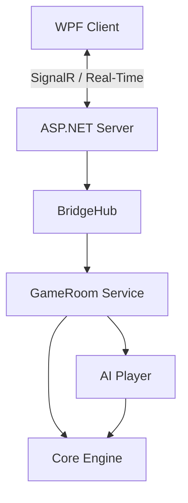

# Honor Bridge Architecture

## 1. High-Level Design

Honor Bridge follows a **Client-Server Architecture** decoupled via **SignalR**.

-   **HonorBridge.Server**: An ASP.NET Core application acting as the Game Server. It hosts the Game Logic (Engine) and manages real-time communication.
-   **HonorBridge.Client.Wpf**: A WPF Desktop application acting as the User Interface. It connects to the Server via SignalR.
-   **HonorBridge.Engine**: A shared Class Library containing the core rules of Bridge (Deck, Cards, Bidding, Scoring).
-   **HonorBridge.AI**: A library containing AI logic (`MonteCarloAI`, `ParametricBidder`).

## 2. Project Structure

### `src/HonorBridge.Engine`
Pure C# Library (netstandard/net8). Contains no UI or Server dependencies.
-   **Entities**: `Card`, `Deck`, `Hand`, `Trick`, `Auction`, `DealPlay`.
-   **Logic**: `Scoring`, `Auction` validation.

### `src/HonorBridge.Server`
ASP.NET Core Web API / SignalR Host.
-   **Hubs**: `BridgeHub` (Handling `Join`, `Bid`, `Play` messages).
-   **Services**: `LobbyService` (Manages rooms), `GameRoom` (Game Instance state machine).
-   **Models**: DTOs for client communication (`GameStateDto`).

### `src/HonorBridge.Client.Wpf`
Windows Presentation Foundation (WPF) App.
-   **MVVM**: Uses `CommunityToolkit.Mvvm`.
-   **ViewModels**: `MainViewModel`, `LobbyViewModel`, `GameTableViewModel`.
-   **Services**: `SignalRClientService` (Wraps connection logic).

### `src/HonorBridge.AI`
AI Logic.
-   **Bidding**: `SaycBidder`, `ParametricBidder`.
-   **Play**: `MonteCarloAI` (Simulation engine).

## 3. Data Flow
1.  **Action**: User clicks "Bid 1H" in Client.
2.  **Command**: ViewModel calls `SignalRClientService.SendBid("1H")`.
3.  **Network**: Message sent to Server `BridgeHub.MakeBid`.
4.  **Server**: Hub invokes `GameRoom.MakeBidAsync`.
5.  **Logic**: `GameRoom` uses `Auction.MakeCall`.
6.  **Event**: `GameRoom` triggers `OnStateChanged`.
7.  **Update**: Hub broadcasts `ReceiveState` to all clients in the room.
8.  **Client**: `SignalRClientService` receives DTO, updates `MainViewModel`.
