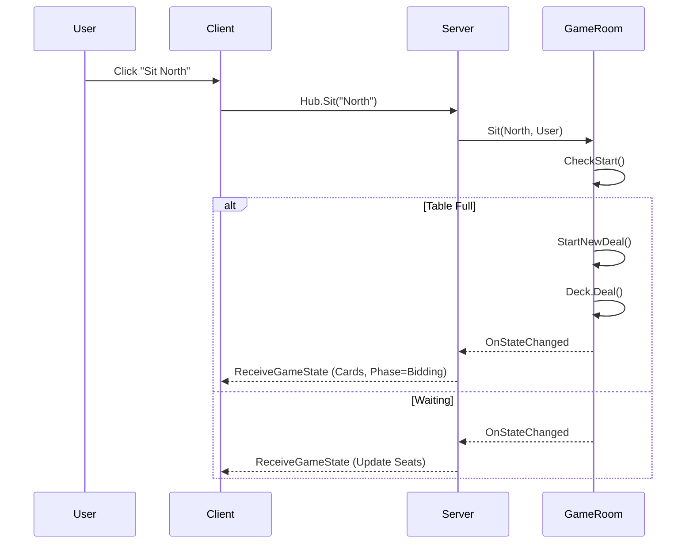
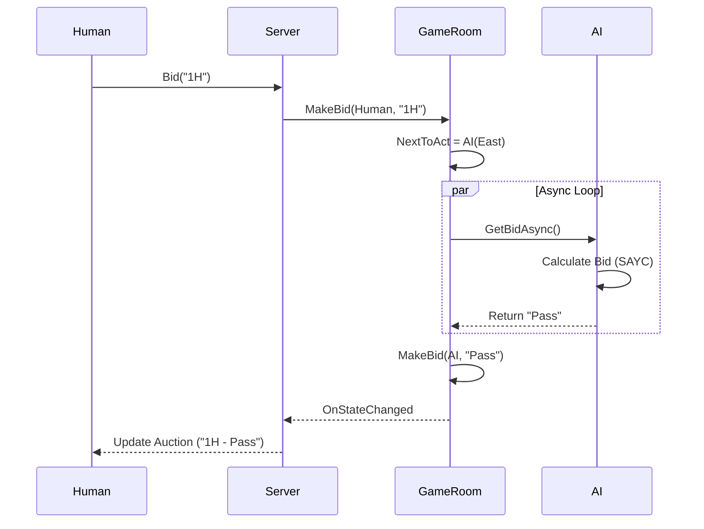

# Sequence Diagrams

## 1. Game Start Flow (Sitting & Dealing)

```mermaid
sequenceDiagram
    participant User
    participant Client
    participant Server
    participant GameRoom

    User->>Client: Click "Sit North"
    Client->>Server: Hub.Sit("North")
    Server->>GameRoom: Sit(North, User)
    GameRoom->>GameRoom: CheckStart()
    
    alt Table Full
        GameRoom->>GameRoom: StartNewDeal()
        GameRoom->>GameRoom: Deck.Deal()
        GameRoom-->>Server: OnStateChanged
        Server-->>Client: ReceiveGameState (Cards, Phase=Bidding)
    else Waiting
        GameRoom-->>Server: OnStateChanged
        Server-->>Client: ReceiveGameState (Update Seats)
    end
```

## 2. Bidding Flow (AI Interaction)

```mermaid
sequenceDiagram
    participant Human
    participant Server
    participant GameRoom
    participant AI

    Human->>Server: Bid("1H")
    Server->>GameRoom: MakeBid(Human, "1H")
    GameRoom->>GameRoom: NextToAct = AI(East)
    
    par Async Loop
        GameRoom->>AI: GetBidAsync()
        AI->>AI: Calculate Bid (SAYC)
        AI-->>GameRoom: Return "Pass"
    end
    
    GameRoom->>GameRoom: MakeBid(AI, "Pass")
    GameRoom-->>Server: OnStateChanged
    Server-->>Human: Update Auction ("1H - Pass")
```
